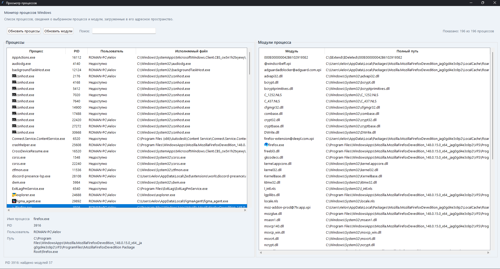

# Лабораторная работа 5

Небольшое приложение на `Tkinter` для просмотра процессов Windows и модулей, которые использует выбранный процесс.

## Что умеет программа

- показывает список процессов;
- отображает `PID`, пользователя и путь к исполняемому файлу;
- позволяет быстро фильтровать процессы через строку поиска;
- показывает сведения о выбранном процессе;
- выводит список модулей процесса;
- по возможности отображает значки `.exe` и `.dll`.

## Требования

- Windows;
- Python 3.10+;
- установленные зависимости `psutil`, `Pillow`, `pywin32`.

## Установка зависимостей

Откройте терминал в папке `lab5` и выполните:

```powershell
pip install psutil Pillow pywin32
```

## Запуск

Из папки `lab5` выполните:

```powershell
python main.py
```

## Как пользоваться

1. Нажмите `Обновить процессы`, если список нужно перечитать.
2. Введите часть имени процесса, `PID` или путь в поле `Поиск`, чтобы отфильтровать список.
3. Выберите процесс в левой таблице.
4. Справа появится список модулей выбранного процесса.



## Возможные ограничения

- Для некоторых системных процессов Windows может не дать доступ к списку модулей.
- Количество найденных модулей зависит от прав доступа и особенностей конкретного процесса.
